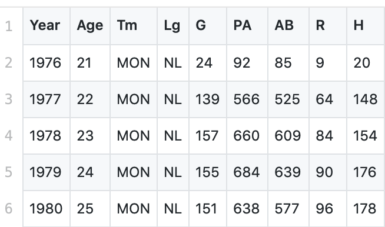
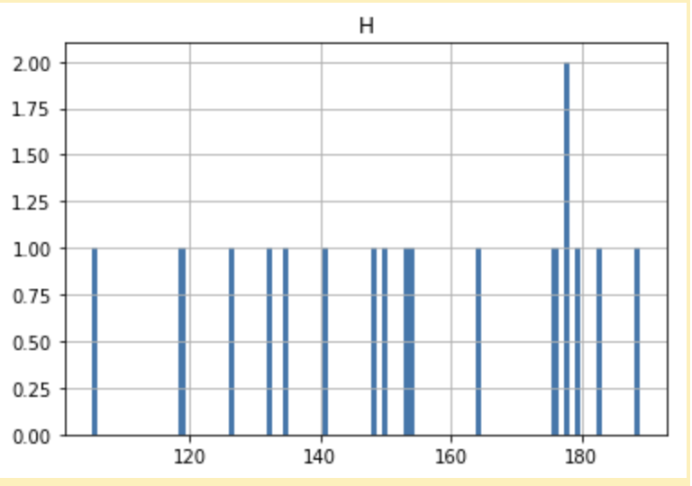

# pandas-intro
This repo contains material for an introductory workshop to the python package pandas.

## Who am I?
* [Data Scientist with the Data Science Institute](https://dsi.virginia.edu/people/peter-alonzi)
* I like to be interrupted with questions! Please jump right in.

## Welcome to the UVA Library
* [Research Data Services](https://data.library.virginia.edu/)
* [Workshop Series](https://data.library.virginia.edu/training/)
 
## Getting Pandas
Mothership: https://pandas.pydata.org/
* conda install pandas
* python3 -m pip install --upgrade pandas

To confirm installation:
* open python and type <pre>import pandas as pd</pre>

# Goals for Today
1. Get pandas working on your machine
2. Get comfortable with pandas (know what it's all about)
3. Learn how to look up help

## Outline
1. Read data into pandas
2. Manipulate data with pandas
3. Plot data with pandas

## A brief history
* Designed by [Wes McKinney](http://wesmckinney.com/) - launched in 2008
  * https://www.blockchain.com/btc/address/1CUztXcgPYfL1AXuv8FD8XDyPXTc2jcheg
  * https://etherscan.io/address/0x5BC648c302d6aF9D921DE31d0DB2411D26686A4a
* version 0.24.1

## The Data Frame
Using pandas the main tool is the data frame. We use it to hold data and perform operations on the data frame to prepare the data for our end goal. Depending on where you want to go some end functions are also built into the data frame (eg make a histogram). However ...

### Often pandas data frames are confusing to new users. Almost always that is not the fault of the new user.

### Quick survey: Who knows R?

* "Two-dimensional size-mutable, potentially heterogeneous tabular data structure with labeled axes (rows and columns). Arithmetic operations align on both row and column labels. Can be thought of as a dict-like container for Series objects. The primary pandas data structure." [official documentation](https://pandas.pydata.org/pandas-docs/stable/reference/api/pandas.DataFrame.html)
  
The trick is pandas data frames have a lot of capability and a lot of features. But when learning you don't need that. So today we'll take a different approach and focus on the basics.

* Working definition of Data Frame: 
    <pre> An allocation of computer memory that holds data. The format works like a spreadsheet.</pre>
* What a data fame "looks like"
       

# Reading in Data
Our first step is to read data into a pandas data frame. It may be coming from many diferent sources (Eg: a file in storage, an object in memory, the internet, etc.). Here we will look at the example of reading in from a file (.csv).
 
  * read from csv files
    * docs: https://pandas.pydata.org/pandas-docs/stable/reference/api/pandas.read_csv.html
      
      don't worry if this looks intimidating, we'll break it down
  * Let's write a program
    <pre>
    # load pandas package
    import pandas as pd      
    # Part 1: read data into data frame
    df =  pd.read_csv("andre.csv")
    </pre>
    
# Manipulating Data

df.head()  / df.tail() / df.sample(5)

select columns: df [ [list of columns] ]  / df.columnName

filter (aka keep rows that match a condition): df [ df.columnName == ??? ] .... extension look at just df.columnName == ???

arrange (aka sort by column): 

mutate (aka create new columns):

# Aggregation / summarization

# Making plots
Let's make a histogram from our sample dataset. Since we are using a data frame this feature is already built in

<pre>
# make a histogram
df.hist("H",bins=100)
</pre>

# Ways to Practice
1. Write some code
2. Ask a friend to review it

* Beginning
  * Flip a coin (~10 lines)
  * Play rock, paper, scissors  (~25 lines)
* Intermediate
  * Guess a secret number between 1 and 10. With hints. (~20 lines)
  * Dice rolling program
* Expert
  * Play blackjack
  * Play roulette
